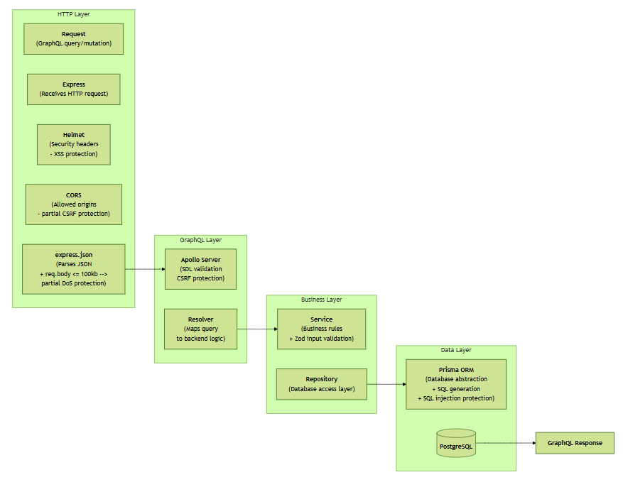

# LOTR GraphQL Wiki API

GraphQL API example for a Lord of the Rings wiki. The backend uses Node.js, Express, Apollo Server, Prisma 7, PostgreSQL, and Docker Compose.

## Request/Response Flow



---

## Database Models

The database models are written in:

```txt
lotr-graphql-wiki/server/prisma/schema.prisma
```

- The Prisma schema defines the database structure.
- It specifies all database models, fields, relationships, and constraints.
- Prisma uses the schema to generate the Prisma Client and create database migrations.
- PostgreSQL tables are created based on the Prisma schema.

---

## GraphQL SDL Schema - (Schema Definition Language)

The SDL schema is written in:

```txt
lotr-graphql-wiki/server/src/graphql/schema.graphql
```

- The GraphQL SDL (Schema Definition Language) schema defines the API contract.
  It specifies all available:
  - types
  - queries
  - mutations
  - inputs
  - relationships

- Apollo Server uses the schema to validate incoming GraphQL requests and determine which operations are available to clients.

---

## Start the project with Docker Compose

Go to the server folder:

```bash
cd lotr-graphql-wiki/server
```

Start PostgreSQL and the GraphQL server:

```bash
docker compose up -d --build
```

Check that both containers are running:

```bash
docker ps
```

You should see:

```txt
lotr_graphql_postgres
lotr_graphql_server
```

The API runs at:

```txt
http://localhost:4000/graphql
```

---

## Run database migrations

In the Docker Compose configuration, the command below resets the database, applies all Prisma migrations, seeds the database, and starts the API.

```bash
command: sh -c "npx prisma migrate reset --force && npm run seed && npm start"
```

This creates the database tables from the committed Prisma migration files.

For local development, if you change `prisma/schema.prisma` and need to create a new migration, run this from the host machine while the database container is running:

```bash
npx prisma migrate dev --name your_migration_name
```

The seed file is here:

```txt
lotr-graphql-wiki/server/prisma/seed.js
```

### How to keep the postgres volume

The database is currently recreated on every startup because the Docker Compose command uses:

```bash
command: sh -c "npx prisma migrate reset --force && npm run seed && npm start"
```

To keep the PostgreSQL volume and existing data, **after the first run** replace the startup command with:

```bash
command: sh -c "npx prisma migrate deploy && npm start"
```

This applies any pending migrations without deleting existing data.

---

## Useful Docker commands

Start containers:

```bash
docker compose up -d --build
```

Stop containers:

```bash
docker compose down
```

Stop containers and delete the PostgreSQL volume/data:

```bash
docker compose down -v
```

Open a shell inside the server container:

```bash
docker compose exec server sh
```

Open PostgreSQL CLI inside the database container:

```bash
docker compose exec postgres psql -U lotr_user -d lotr_wiki_db
```

---

## Postman Test Collection

The Postman collection is included here:

```txt
lotr-graphql-wiki/server/tests/LOTR GraphQL API - GraphQL Mode Tests.postman_collection
```

Import it into Postman:

```txt
Postman → Import → File → select LOTR GraphQL API - GraphQL Mode Tests.postman_collection
```

Set or verify the collection variable:

```txt
baseUrl = http://localhost:4000

createdCharacterId = ""

createdQuoteId = ""
```

The collection contains both positive and negative tests.

### Positive Tests

```txt
Query all characters
Query character by ID
Create character
Update created character
Delete created character

Query all quotes
Query quote by ID
Create quote
Update quote
Delete quote
```

These tests verify that the GraphQL API can successfully retrieve and modify data in PostgreSQL through Prisma ORM.

### Negative Tests

```txt
Query non-existing character
Create character with missing required name
Create character with invalid imageUrl
Delete character with invalid ID

Query non-existing quote
Create quote with missing required text
Update quote with invalid ID
Delete quote with invalid ID
```

### Security Tests

```txt
XSS-like input should be rejected or sanitized
SQL injection-like search should not break API
```

### Utility / Schema Exploration Queries

These use GraphQL introspection to explore the schema and discover available operations and fields.

```txt
Get available queries + mutations
Get Character fields
Get Quote fields
```

---

## Security

Security is implemented in multiple layers throughout the application.

### HTTP Security Headers (Helmet)

**Location**: src/security/securityMiddleware.js

**Applied in**: src/app.js

Helmet automatically adds security-related HTTP headers to responses, helping protect clients against common browser-based attacks such as XSS, and clickjacking by adding browser security headers such as Content-Security-Policy (CSP), which restricts where scripts can be loaded from and executed.

### CORS Protection

**Location**: src/security/securityMiddleware.js

**Applied in**: src/app.js

CORS restricts which browser frontends are allowed to access the API. Only approved origins, methods, and headers are accepted.

### Request Size Limiting

**Location**: src/app.js

`express.json({ limit: "100kb" })`

Incoming JSON request bodies larger than 100 KB are automatically rejected to reduce the impact of resource exhaustion and DoS attacks.

### GraphQL Schema Validation

**Location**: src/graphql/schema.graphql

Apollo Server validates all incoming GraphQL requests against the SDL schema before any resolver is executed.

### CSRF Protection

**Location**: src/server.js

`csrfPrevention: true`

Apollo Server's built-in CSRF protection rejects suspicious browser requests before they reach the GraphQL resolvers.

### Input Validation

**Location**: src/validation/

**Files**:

- characterValidation.js
- quoteValidation.js

User input is validated using Zod schemas before data is processed.

**Validation includes:**

- Required fields
- Field length limits
- URL validation
- HTML tag rejection

### SQL Injection Prevention

**Location**: src/repositories/

Database access is performed through Prisma ORM. Prisma generates parameterized queries, which prevents user input from being interpreted as executable SQL.
